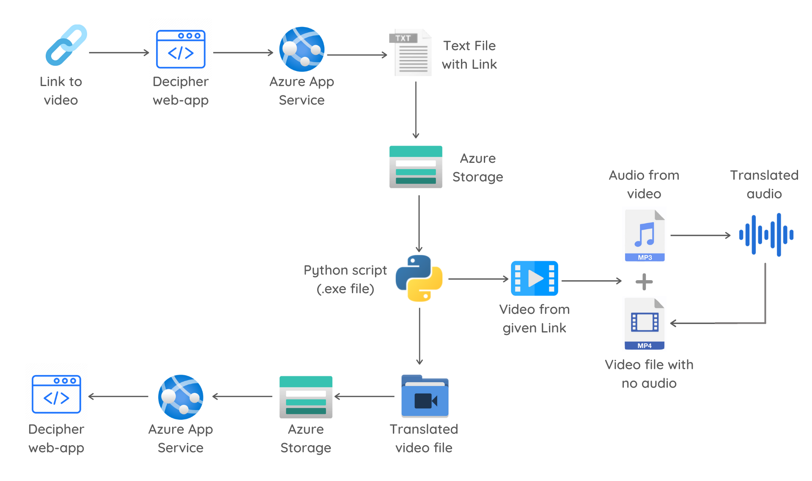

## DECIPHER | <i>Breaking the Walls of Linguistic Barrier</i>

Decipher is a revolutionary tool to help get rid off the linguistic barriers pertaining among the people by providing a unique portal to translate the audio in the videos into the user's preferred language.

## Table of Content
- [Positive Impact](#positive-impact)
- [Instructions](#instructions)
- [Technology Stack](#technology-stack)
- [Flowchart](#flowchart)
- [Architecture](#architecture)
- [Demo Video](#demo-video)
- [Outreach](#outreach)
- [Outreach](#outreach)
- [Future Scope](#future-scope)
- [Feature Request](#feature-request)
- [License](#license)

## 🗂 Positive Impact

    
<b>Universal Learning Platform :</b> With most of the online tutorials in English and Hindi, the non-native speakers face many difficulties.

    
<b>Making Education Accessible :</b> Poor people often cannot afford English education which hampers the development of their skill sets.

    
<b>Economic Growth :</b> Millions of dollars are spent for producing dubbed versions of videos, making it very costly.

## 📖 Instructions
### Decipher Webapp - Local deployment
**Installation of Node.js :** Follow the steps in [npm docs](https://docs.npmjs.com/downloading-and-installing-node-js-and-npm/) to install Node.js

1. Clone the [Github repo](https://github.com/nayyhah/Decipher) using 
`git clone https://github.com/abhishek-iiit/Decipher`

2. Go to the directory of *Decipher597* in the cloned directory 
`cd "Decipher/Decipher597"`

3. Run the npm server: 
`npm start`

4. Click on the link displayed in the CLI *[(http://localhost:8080/)](http://localhost:8080/)* to go to the Decipher webapp

5. Copy the link of the YouTube video that is to be translated

6. Paste it in Decipher's webapp

7. Select the language that the video needs to be translated into

8. Click on covert button

## 🎛 Technology Stack
Tools and Technologies
- **Azure Blob Storage :** *storing intermediate results*
- **Azure App Services :** *deploying the web-app*

Frameworks and Language
- **Node.js :** *development of Decipher web-app*
- **Python :** *video language translation*

Development
- **Azure ML Studio/Azure Notebook :** *Python script for translating video*
- **MS Visual Studio Code :** *Node.js development of web-app*

## 🛠 Architecture

## 🎮 Demo Video

 > [DECIPHER Implementation Video](https://www.youtube.com/watch?v=L3rnBu09vU0)
 
 > [DECIPHER Demo Video](https://www.youtube.com/watch?v=Z3HrvIjwNeA)

## 🏷 Outreach
With ___60+ distinct languages___ and different accents, Decipher aims to benefit at least __80%__ of the world’s population. It can be used in various fields including, but not limited to:

- Education
- International businesses
- Entertainment industries
- Sports
- Language Learning

## 🧲 Future Scope

    
<b>Integrating with online learning platforms :</b> Allows people to sign in using their accounts in learning platforms like Coursera, etc. and translate the audio to the courses they have access to.

    
<b>Addition of real-time translation :</b> Aids in eradicating linguistic barriers in online classes and meets, thus allowing students from diverse backgrounds to attend classes.

    
<b>Inclusion of sign language :</b> Useful for people with auditory impairments, thus increasing digital accessibility.

 

## 🐛 Bug Reporting

Feel free to [open an issue](https://github.com/abhishek-iiit/Decipher/issues) on GitHub if you find any bug.

## ⭐ Feature Request

- Feel free to [Open an issue](https://github.com/abhishek-iiit/Decipher/issues) on GitHub to request any additional features you might need for your use case.
- Connect with me on [LinkedIn](https://www.linkedin.com/in/abhishek-iiit/). I'd love ❤️️ to hear where you are using this system.

## 📜 License

This software is open source, licensed under the [MIT License](https://github.com/abhishek-iiit/Decipher/blob/main/LICENSE).

> <i>Get ready to witness the whole world in your eye, in your language, with Decipher!</i> 
